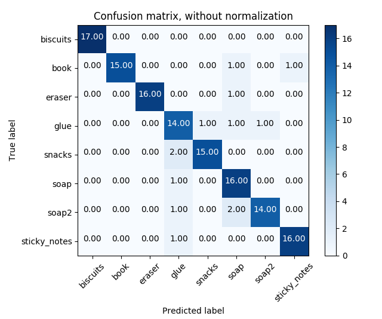
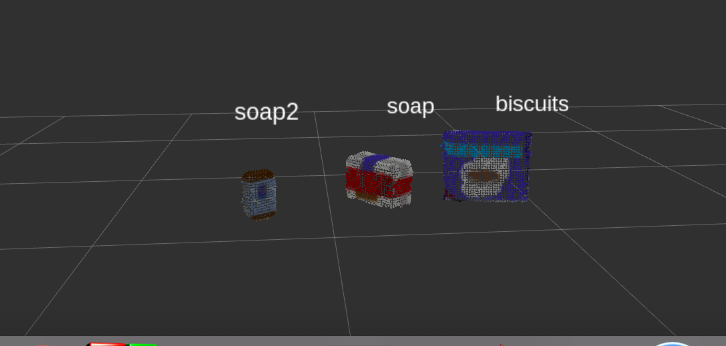
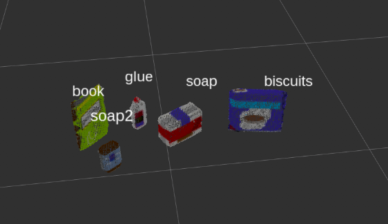
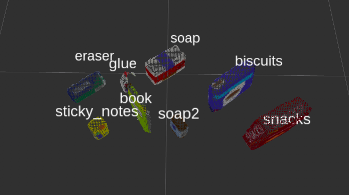

[](https://www.udacity.com/robotics)

# Project: 3D Perception with PR2 Robot

### Writeup by Rohit Kumar Mishra

#### 1. Provide a Writeup / README that includes all the rubric points and how you addressed each one.  You can submit your writeup as markdown or pdf.  

You're reading it!

### Exercise 1, 2 and 3 pipeline implemented
#### 1. Complete Exercise 1 steps. Pipeline for filtering and RANSAC plane fitting implemented.

[Here is a link to my python script for all exercises & the project.](https://github.com/rohit0453/rohit0453-Udacity-RoboND-project-3-RoboND-Perception-Project/blob/master/src/pr2_robot/scripts/project_template.py)

# Results yaml files:

The output yaml files are on the following links:

[**output_1.yaml**](./output_1.yaml)

[**output_2.yaml**](./output_2.yaml)

[**output_3.yaml**](./output_3.yaml)

# Helping Functions


```python
# Function to get surface normals
def get_normals(cloud):
    get_normals_prox = rospy.ServiceProxy('/feature_extractor/get_normals', GetNormals)
    return get_normals_prox(cloud).cluster
```

```python
# Function to create a yaml friendly dictionary from ROS messages
def make_yaml_dict(test_scene_num, arm_name, object_name, pick_pose, place_pose):
    yaml_dict = {}
    yaml_dict["test_scene_num"] = test_scene_num.data
    yaml_dict["arm_name"]  = arm_name.data
    yaml_dict["object_name"] = object_name.data
    yaml_dict["pick_pose"] = message_converter.convert_ros_message_to_dictionary(pick_pose)
    yaml_dict["place_pose"] = message_converter.convert_ros_message_to_dictionary(place_pose)
    return yaml_dict
```

```python
# Function to output to yaml file
def send_to_yaml(yaml_filename, yaml_dict_list):
    data_dict = {"object_list": yaml_dict_list}
    with open(yaml_filename, 'w') as outfile:
        yaml.dump(data_dict, outfile, default_flow_style=False)
```

```python
# Function to search list of dictionaries and return a selected value in selected dictionary
def search_dictionaries(key1, value1, key2, list_of_dictionaries):
    selected_dic = [element for element in list_of_dictionaries if element[key1] == value1][0]
    selected_val = selected_dic.get(key2)
    return selected_val
```


# pcl_callback() function

`pcl_callback()` is the function that will be called back every time a message is published to `/pr2/world/points` topic. this function has the 3D point cloud perception pipeline, object detection, and a call to the PR2 mover function.

## The Perception Pipeline

Following sections will explain the different stages of the perception pipeline used to detect objects before starting the pick and place robot movement.


## Select topic and convert ROS msg to PCL data

The first step in the perception pipeline is to subscribe to the the camera data (point cloud) topic `/pr2/world/points` from which we will get a point cloud with noise as seen below:


before we can process the data we need to convert it from **ROS PointCloud2** message to a **PCL PointXYZRGB** format using the following code:

```python
cloud_filtered = ros_to_pcl(ros_pcl_msg)
```

## Statistical Outlier Filtering

First filter is the  **PCL’s Statistical Outlier Removal** filter. in this filter for each point in the point cloud, it computes the distance to all of its neighbors, and then calculates a mean distance. By assuming a Gaussian distribution, all points whose mean distances are outside of an interval defined by the global distances mean+standard deviation are considered to be outliers and removed from the point cloud.

Code is as following:

```python
    # Create a statistical filter object: 
    outlier_filter = cloud_filtered.make_statistical_outlier_filter()
    # Set the number of neighboring points to analyze for any given point
    outlier_filter.set_mean_k(3)
    # Set threshold scale factor
    x = 0.00001
    # Any point with a mean distance larger than global (mean distance+x*std_dev)
    # will be considered outlier
    outlier_filter.set_std_dev_mul_thresh(x)
    # Call the filter function
    cloud_filtered = outlier_filter.filter()
```
Mean K = 3 was the best value I found to almost remove all noise pixels. any value higher than 3 was leaving some of the noise pixels behind. x was selected to be 0.00001.


## Voxel Grid Downsampling

2nd stage is **Voxel Grid Downsampling** filter to derive a point cloud that has fewer points but should still do a good job of representing the input point cloud as a whole. This is done to reduce required computation power without impacting the final results. Code is as following:

```python
    # Create a VoxelGrid filter object for our input point cloud
    vox = cloud_filtered.make_voxel_grid_filter()
    # Choose a voxel (also known as leaf) size
    # 1 means 1mx1mx1m leaf size   
    LEAF_SIZE = 0.005  
    # Set the voxel (or leaf) size  
    vox.set_leaf_size(LEAF_SIZE, LEAF_SIZE, LEAF_SIZE)
    # Call the filter function to obtain the resultant downsampled point cloud
    cloud_filtered = vox.filter()
```
After trying different sizes I have selected leaf size 0.005 to avoid any impact on point cloud details.


## PassThrough Filter

3rd stage is PassThrough filter which works much like a cropping tool allowing to crop any given 3D point cloud by specifying an axis with cut-off values along that axis. The region you allow to pass through, is often referred to as region of interest.


```python
    # Create a PassThrough filter object.
    passthrough = cloud_filtered.make_passthrough_filter()
    # Assign axis and range to the passthrough filter object.
    filter_axis = 'z'
    passthrough.set_filter_field_name(filter_axis)
    axis_min = 0.6095
    axis_max = 1.1
    passthrough.set_filter_limits(axis_min, axis_max)
    # Use the filter function to obtain the resultant point cloud. 
    cloud_filtered = passthrough.filter()
```


Second is along **Y axis** to remove the unwanted left and right edges of the table. Code is as following:

```python
    # Create a PassThrough filter object.
    passthrough = cloud_filtered.make_passthrough_filter()
    # Assign axis and range to the passthrough filter object.
    filter_axis = 'y'
    passthrough.set_filter_field_name(filter_axis)
    axis_min = -0.456
    axis_max =  0.456
    passthrough.set_filter_limits(axis_min, axis_max)
    # Use the filter function to obtain the resultant point cloud. 
    cloud_filtered = passthrough.filter()
```


## RANSAC Plane Segmentation

Next we need to remove the table itself from the scene. To do this we will use a popular technique known as Random Sample Consensus or "RANSAC". RANSAC is an algorithm, that we can use to identify points in our dataset that belong to a particular model. In the case of the 3D scene we are working with here, the model we choose could be a plane, a cylinder, a box, or any other common shape. Since the top of the table in the scene is the single most prominent plane, after ground removal, we can effectively use RANSAC to identify points that belong to the table and discard/filter out those points.

code is as following:

```python
    # Create the segmentation object
    seg = cloud_filtered.make_segmenter()
    # Set the model you wish to fit 
    seg.set_model_type(pcl.SACMODEL_PLANE)
    seg.set_method_type(pcl.SAC_RANSAC)
    # Max distance for a point to be considered fitting the model
    # Experiment with different values for max_distance 
    # for segmenting the table
    max_distance = 0.006
    seg.set_distance_threshold(max_distance)
    # Call the segment function to obtain set of inlier indices and model coefficients
    inliers, coefficients = seg.segment()
    # Extract inliers (Table)
    extracted_table   = cloud_filtered.extract(inliers, negative=False)
    # Extract outliers (Tabletop Objects)
    extracted_objects = cloud_filtered.extract(inliers, negative=True)
```


## Euclidean Clustering

Last filtering step is to use **PCL's Euclidean Clustering** algorithm to segment the remaining points into individual objects. code is as following:

```python
    white_cloud = XYZRGB_to_XYZ(extracted_objects)
    tree = white_cloud.make_kdtree()
    # Create a cluster extraction object
    ec = white_cloud.make_EuclideanClusterExtraction()
    # Set tolerances for distance threshold 
    # as well as minimum and maximum cluster size (in points)
    ec.set_ClusterTolerance(0.03)
    ec.set_MinClusterSize(10)
    ec.set_MaxClusterSize(9000)
    # Search the k-d tree for clusters
    ec.set_SearchMethod(tree)
    # Extract indices for each of the discovered clusters
    cluster_indices = ec.Extract()
```

## Create Cluster-Mask Point Cloud to visualize each cluster separately

Then we use the following code to add a color for each segmented object:

```python
    # Assign a color corresponding to each segmented object in scene
    cluster_color = get_color_list(len(cluster_indices))
    color_cluster_point_list = []
    for j, indices in enumerate(cluster_indices):
        for i, indice in enumerate(indices):
            color_cluster_point_list.append([white_cloud[indice][0],
                                             white_cloud[indice][1],
                                             white_cloud[indice][2],
                                             rgb_to_float(cluster_color[j])])
    # Create new cloud containing all clusters, each with unique color
    cluster_cloud = pcl.PointCloud_PointXYZRGB()
    cluster_cloud.from_list(color_cluster_point_list)
 ```


## Converts a pcl PointXYZRGB to a ROS PointCloud2 message

Befor we can publish the processed point clouds we need to convert the format back from **PCL PointXYZRGB** to **ROS PointCloud2** message:

```python
    ros_cloud_objects = pcl_to_ros(extracted_objects)
    ros_cloud_table   = pcl_to_ros(extracted_table)
    ros_cluster_cloud = pcl_to_ros(cluster_cloud)
```

## Publish ROS messages

finally we publish to required topics:

```python
    pcl_objects_pub.publish(ros_cloud_objects)
    pcl_table_pub.publish(ros_cloud_table)
    pcl_cluster_pub.publish(ros_cluster_cloud)
```


## Object Prediction

Having the segmented objects, now we can use the SVM algorithm to predict each object. We will be using code that was developed in previous exercises:

Following are helping functions used to capture features:

## compute_color_histograms() function
```python
def compute_color_histograms(cloud, using_hsv=False):

    # Compute histograms for the clusters
    point_colors_list = []

    # Step through each point in the point cloud
    for point in pc2.read_points(cloud, skip_nans=True):
        rgb_list = float_to_rgb(point[3])
        if using_hsv:
            point_colors_list.append(rgb_to_hsv(rgb_list) * 255)
        else:
            point_colors_list.append(rgb_list)

    # Populate lists with color values
    channel_1_vals = []
    channel_2_vals = []
    channel_3_vals = []

    for color in point_colors_list:
        channel_1_vals.append(color[0])
        channel_2_vals.append(color[1])
        channel_3_vals.append(color[2])
    
    # Compute histograms
    nbins=32
    bins_range=(0, 256)
        
    # Compute the histogram of the channels separately
    channel_1_hist = np.histogram(channel_1_vals, bins=nbins, range=bins_range)
    channel_2_hist = np.histogram(channel_2_vals, bins=nbins, range=bins_range)
    channel_3_hist = np.histogram(channel_3_vals, bins=nbins, range=bins_range)
    
    # Concatenate the histograms into a single feature vector
    hist_features = np.concatenate((channel_1_hist[0], channel_2_hist[0], channel_1_hist[0])).astype(np.float64)
    
    # Normalize the result
    normed_features = hist_features / np.sum(hist_features)

    # Generate random features for demo mode.  
    # Replace normed_features with your feature vector
    #normed_features = np.random.random(96) 

    # Return the feature vector
    return normed_features 

```

## compute_normals_histograms() function
```python
def compute_normal_histograms(normal_cloud):
    norm_x_vals = []
    norm_y_vals = []
    norm_z_vals = []

    for norm_component in pc2.read_points(normal_cloud,
                                          field_names = ('normal_x', 'normal_y', 'normal_z'),
                                          skip_nans=True):
        norm_x_vals.append(norm_component[0])
        norm_y_vals.append(norm_component[1])
        norm_z_vals.append(norm_component[2])

    # Compute histograms of normal values (just like with color)

    nbins=32
    bins_range=(-1, 1)
        
    # Compute the histogram of the channels separately
    norm_x_hist = np.histogram(norm_x_vals, bins=nbins, range=bins_range)
    norm_y_hist = np.histogram(norm_y_vals, bins=nbins, range=bins_range)
    norm_z_hist = np.histogram(norm_z_vals, bins=nbins, range=bins_range)
    
    # Concatenate the histograms into a single feature vector
    hist_features = np.concatenate((norm_x_hist[0], norm_y_hist[0], norm_z_hist[0])).astype(np.float64)
    
    # Normalize the result
    normed_features = hist_features / np.sum(hist_features)

    # Generate random features for demo mode.  
    # Replace normed_features with your feature vector
    #normed_features = np.random.random(96)

    return normed_features
```
Full code for capturing features and training SVM:

[Features code](./src/sensor_stick/src/sensor_stick/features.py)

[Capture Features code](./src/sensor_stick/scripts/capture_features.py)

[Train SVM code](./src/sensor_stick/scripts/train_svm.py)


Code to detect the objects using above functions:

```python
    detected_objects_labels = []
    detected_objects = []

    for index, pts_list in enumerate(cluster_indices):

        
        # Grab the points for the cluster from the extracted_objects
        
        pcl_cluster = extracted_objects.extract(pts_list)
        # Convert the cluster from pcl to ROS using helper function
        ros_cluster = pcl_to_ros(pcl_cluster)

        
        # Generate Histograms
        
        # Color Histogram
        c_hists = compute_color_histograms(ros_cluster, using_hsv=True)
        # Normals Histogram
        normals = get_normals(ros_cluster)
        n_hists = compute_normal_histograms(normals)
        
        
        # Generate feature by concatenate of color and normals.
        
        feature = np.concatenate((c_hists, n_hists))
        
        
        # Make the prediction
        
        # Retrieve the label for the result and add it to detected_objects_labels list
        prediction = clf.predict(scaler.transform(feature.reshape(1,-1)))
        label = encoder.inverse_transform(prediction)[0]
        detected_objects_labels.append(label)

        
        # Publish a label into RViz
        
        label_pos = list(white_cloud[pts_list[0]])
        label_pos[2] += .2
        object_markers_pub.publish(make_label(label,label_pos, index))


        # Add the detected object to the list of detected objects.
        
        do = DetectedObject()
        do.label = label
        do.cloud = ros_cluster
        detected_objects.append(do)
        
    rospy.loginfo('Detected {} objects: {}'.format(len(detected_objects_labels), detected_objects_labels))

    
    # Publish the list of detected objects
    
    detected_objects_pub.publish(detected_objects)
  ```


## Invoking PR2 Mover Function

   Last part of `pcl_callback()` function is to call the PR2 mover to pick and place detected objects.

```python
    if len(detected_objects)>0:
        try:
            pr2_mover(detected_objects)
        except rospy.ROSInterruptException:
            pass
    else:
        rospy.logwarn('No detected objects !!!')
```

# PR2_Mover function

First step in mover fuction is to initialize variables including ROS messages.

## Initialize variables

```python
    test_scene_num = Int32()
    object_name    = String()
    pick_pose      = Pose()
    place_pose     = Pose()
    arm_name       = String()
    yaml_dict_list = []
    
    # Update test scene number based on the selected test.
    test_scene_num.data = 3
```

## Get Parameters from ROS parameters server

read objects list and drop box data from ROS parameters server.

```python
    object_list_param = rospy.get_param('/object_list')
    dropbox_param     = rospy.get_param('/dropbox')
```


## Rotate PR2 in place to capture side tables for the collision map

This is to rotate PR2 to capture side tables data to avoid collision. This can be further enhanced as mentioned in last section of project text.

```python
    # Rotate Right
    pr2_base_mover_pub.publish(-1.57)
    rospy.sleep(15.0)
    # Rotate Left
    pr2_base_mover_pub.publish(1.57)
    rospy.sleep(30.0)
    # Rotate Center
    pr2_base_mover_pub.publish(0)
```

## Calculate detected objects centroids.

here we will calculate the centroid (x,y,z) of each detected object based on its points array.

```python
    labels = []
    centroids = [] # to be list of tuples (x, y, z)
    for object in object_list:
        labels.append(object.label)
        points_arr = ros_to_pcl(object.cloud).to_array()
        centroids.append(np.mean(points_arr, axis=0)[:3])
```

## Loop through the pick list

in this loop we will be picking each object from the pick-list we received through ROS parameter server and match it to one of the detected objects to decide on pick pose, place pose, and arm name. We will write all date to yaml file.

```python
    for i in range(0, len(object_list_param)):
        
        
        # Read object name and group from object list.
        object_name.data = object_list_param[i]['name' ]
        object_group     = object_list_param[i]['group']

        # Select pick pose
        try:
            index = labels.index(object_name.data)
        except ValueError:
            print "Object not detected: %s" %object_name.data
            continue

        pick_pose.position.x = np.asscalar(centroids[index][0])
        pick_pose.position.y = np.asscalar(centroids[index][1])
        pick_pose.position.z = np.asscalar(centroids[index][2])

        # Select place pose
        position = search_dictionaries('group', object_group, 'position', dropbox_param)
        place_pose.position.x = position[0]
        place_pose.position.y = position[1]
        place_pose.position.z = position[2]

        # Select the arm to be used for pick_place
        arm_name.data = search_dictionaries('group', object_group, 'name', dropbox_param)

        # Create a list of dictionaries for later output to yaml format
        yaml_dict = make_yaml_dict(test_scene_num, arm_name, object_name, pick_pose, place_pose)
        yaml_dict_list.append(yaml_dict)

        # Wait for 'pick_place_routine' service to come up
        rospy.wait_for_service('pick_place_routine')
        try:
            pick_place_routine = rospy.ServiceProxy('pick_place_routine', PickPlace)
            # Insert your message variables to be sent as a service request
            resp = pick_place_routine(test_scene_num, object_name, arm_name, pick_pose, place_pose)
            print ("Response: ",resp.success)
        except rospy.ServiceException, e:
            print "Service call failed: %s"%e
```

## Writing yaml files to disk

file will be automatically named based on the selected test number (1-3).

```python
    yaml_filename = 'output_'+str(test_scene_num.data)+'.yaml'
    send_to_yaml(yaml_filename, yaml_dict_list)
```

# Creating ROS Node, Subscribers, and Publishers.

Following code is to create all required ROS node, subscribers, and publishers.

```python
if __name__ == '__main__':

    
    # ROS node initialization
    
    rospy.init_node('clustering', anonymous=True)

    
    # Create Subscribers
    
    pcl_sub = rospy.Subscriber("/pr2/world/points", pc2.PointCloud2, pcl_callback, queue_size=1)

    
    # Create Publishers
    
    pcl_objects_pub      = rospy.Publisher("/pcl_objects"     , PointCloud2,          queue_size=1)
    pcl_table_pub        = rospy.Publisher("/pcl_table"       , PointCloud2,          queue_size=1)
    pcl_cluster_pub      = rospy.Publisher("/pcl_cluster"     , PointCloud2,          queue_size=1)
    object_markers_pub   = rospy.Publisher("/object_markers"  , Marker,               queue_size=1)
    detected_objects_pub = rospy.Publisher("/detected_objects", DetectedObjectsArray, queue_size=1)
    pr2_base_mover_pub   = rospy.Publisher("/pr2/world_joint_controller/command", Float64, queue_size=10)

    # Initialize color_list
    get_color_list.color_list = []

    
    # Load Model From disk
    
    model = pickle.load(open('model.sav', 'rb'))
    clf = model['classifier']
    encoder = LabelEncoder()
    encoder.classes_ = model['classes']
    scaler = model['scaler']

    
    # Spin while node is not shutdown
    
    while not rospy.is_shutdown():
        rospy.spin()

    
```


Results are as following:

Training
| Test  | Values |
|-|-|
| Features in Training Set: | **136** |
| Invalid Features in Training set: | **0** |
| Scores: | **[0.82142857 0.92592593 0.96296296 0.92592593 0.88888889]** |
| Accuracy: | **0.91 (+/- 0.10)** |
| accuracy score: | **0.9044117647058824** |


<p align="center">  </p>

<p align="center">  </p>

# Detected object in 3 different world scenarios

<p align="center">  </p>
<p align="center">  </p>
<p align="center">  </p>


